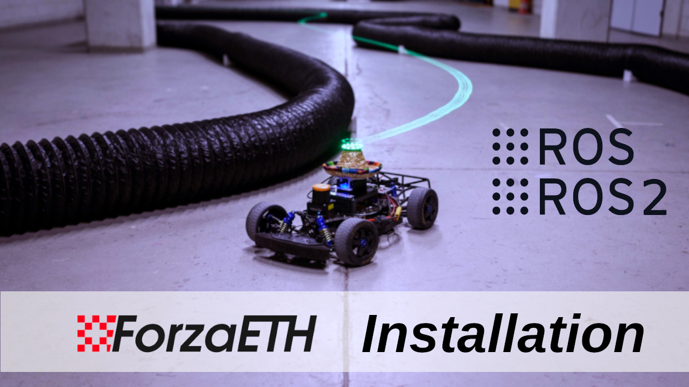
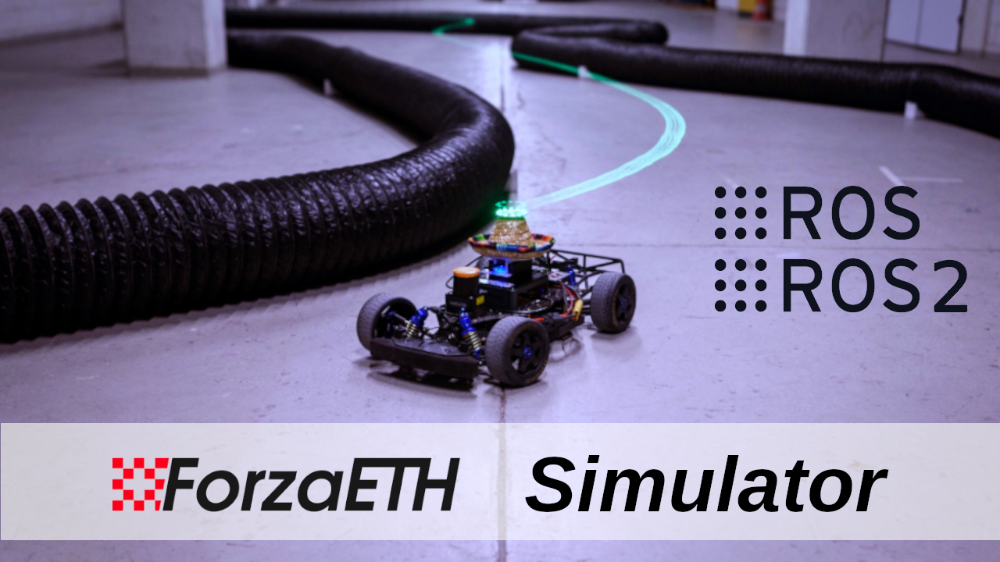

# ROS 2 ForzaETH Race Stack at Center for Project Based Learning

<a href="https://arxiv.org/abs/2403.11784">
    
</a>

ForzaETH Race Stack by the [D-ITET Center for Project Based Learning (PBL)](https://pbl.ee.ethz.ch/) at ETH Zurich. 

Accompanying this repository, a paper titled *ForzaETH Race Stack - Scaled Autonomous Head-to-Head Racing on Fully Commercial off-the-Shelf Hardware* is available on [Journal of Field Robotics](https://onlinelibrary.wiley.com/doi/pdf/10.1002/rob.22429), detailing the system's architecture, algorithms, and performance benchmarks.

**Note:** The results in the paper have been evaluated in the ROS1 version of the stack. As this is the ROS 2 version of the ForzaETH Race Stack, results may differ, as well as certain functionalities might be **missing** such as (might be added in the future):
- Baysian Optimization
- CPU Usage Measurements
- Car2Car Syncing
- SynPF integration
- Scan Alignment
- System Identification

**Note:** In general the ROS 2 stack is significantly less tested and explored than the ROS 1 version!

## Installation

We provide an installation guide [here](.docker_utils/README.md). 

Or check out our [video playlist on Youtube](https://www.youtube.com/playlist?list=PLMzSGo5LtaW9cgdwHB_FnX3qlAYx7P6JI):  
<a href="https://www.youtube.com/watch?v=A9Clg1n6rII">
  
</a>
<a href="https://www.youtube.com/watch?v=6PtFzrRz1GU">
  
</a>
<a href="https://www.youtube.com/watch?v=ACQdLD27v-k">
  
</a>

**Note:** Click on the thumbnails to watch the videos.

## Getting started

After installation, the car (or the simulation environment) is ready to be tested. For examples on how to run the different modules on the car, refer to the [`stack_master` README](./stack_master/README.md).

## Contributing

In case you find our package helpful and want to contribute, please either raise an issue or directly make a pull request. To create pull request please follow the guidelines in [CONTRIBUTING](./CONTRIBUTING.md).

## Acknowledgement
This project would not be possible without the use of multiple great open-sourced code bases as listed below:

- [f1tenth_system](https://github.com/f1tenth/f1tenth_system)
- [F1TENTH Racecar Simulator](https://github.com/f1tenth/f1tenth_simulator)
- [Veddar VESC Interface](https://github.com/f1tenth/vesc)
- [Cartographer](https://github.com/cartographer-project/cartographer)
- [Cartographer ROS Integration](https://github.com/cartographer-project/cartographer_ros)
- [global_racetrajectory_optimization](https://github.com/TUMFTM/global_racetrajectory_optimization)
- [RangeLibc](https://github.com/kctess5/range_libc)
- [BayesOpt4ROS](https://github.com/IntelligentControlSystems/bayesopt4ros)
- [cpu_monitor](https://github.com/alspitz/cpu_monitor)

### Problems
If you are having problem with the SIM (no car/scans showing for example), try the setup once again:
```bash
source ~/ws/src/race_stack/.install_utils/f110_sim_setup.sh
```

If your joystick is not working, try the following while the controller is connected:
```bash
sudo chmod 666 /dev/input/js0
sudo chmod 666 /dev/input/event*
```

## Citing ForzaETH Race Stack

If you found our race stack helpful in your research, we would appreciate if you cite it as follows:
```
@article{baumann2024forzaeth,
  title={ForzaETH Race Stack—Scaled Autonomous Head-to-Head Racing on Fully Commercial Off-the-Shelf Hardware},
  author={Baumann, Nicolas and Ghignone, Edoardo and K{\"u}hne, Jonas and Bastuck, Niklas and Becker, Jonathan and Imholz, Nadine and Kr{\"a}nzlin, Tobias and Lim, Tian Yi and L{\"o}tscher, Michael and Schwarzenbach, Luca and others},
  journal={Journal of Field Robotics},
  year={2024},
  publisher={Wiley Online Library}
}
```

---

## SSUPATH 포크 인수인계 노트

### 클론 후 배치

이 레포의 루트가 곧 `race_stack` 디렉토리다. 컨테이너 안에서는 아래 위치를 가정한다.

```bash
git clone https://github.com/hee4040/ssupath-f1tenth-race-stack.git ~/forza_ws/race_stack
```

서브모듈은 없다. 예전 `.gitmodules`에 있던 `f1tenth_gym`, `f1tenth_gym_ros`,
`global_racetrajectory_optimization`, `vesc` 는 모두 일반 파일로 포함되어 있으므로
`git submodule update` 는 필요 없다. `planner/fsdp` 도 마찬가지로 통째로 포함되어 있다.

### 레포에 포함되지 않은 것

| 항목 | 이유 / 대처 |
| --- | --- |
| `build/`, `install/`, `log/` | `colcon build` 로 생성 |
| `planner/fsdp/src/mpc_builder*.so` | 빌드 시 `mpc_builder.cpp` 에서 자동 생성 (`planner/fsdp/BUILD.md` 참고) |
| rosbag (`obs_debug_*`, `lobby_07*`, `record/`) | 용량. 필요하면 별도 전달 |
| `map.pcd`, `pose_graph.g2o` (루트) | SLAM 실행 산출물 |
| Docker 이미지 / `shared_dir` | 호스트 바인드 마운트. 레포 범위 밖 |

반대로 `controller/mpcc/MPCC/C++/External/**/*.a` (blasfeo, hpipm) 는 ROS 빌드가
자동 생성해주지 않는 외부 의존성이라 `.gitignore` 의 `*.a` 규칙에서 예외로 두고 포함했다.

### RL 컨트롤러 체크포인트

실차 주행용 가중치를 `controller/rl_controller/models/cvar.pt` 로 포함해 두었다.

`controller/rl_controller/config/rl_controller.yaml` 의 `checkpoint` 는 개발 컨테이너
경로(`/home/misys/shared_dir/dacerpp_isaaclab/dacerpp_runs/20260726/cvar.pt`)를 그대로
가리키고 있다. 다른 환경에서는 아래 중 하나로 바꿔서 쓴다.

체크포인트 경로는 launch 인자로 노출되어 있지 않고 param 파일 한 곳에서만 관리한다
(`rl_controller_launch.xml` 주석 참고). 따라서:

```bash
# 방법 1: yaml 의 checkpoint 값을 레포 안 경로로 직접 수정 (권장)
#   checkpoint: "/home/<user>/forza_ws/race_stack/controller/rl_controller/models/cvar.pt"

# 방법 2: yaml 을 복사해 경로만 고치고 rl_param_file 로 넘기기
ros2 launch rl_controller rl_controller_launch.xml \
  rl_param_file:=/path/to/my_rl_controller.yaml
```

주의: 방법 1 로 yaml 을 고쳤으면 `colcon build --packages-select rl_controller` 를 다시
돌려야 `install/` 쪽 share 에 반영된다.

Jetson Orin 에서는 pip torch 가 sm_87 커널을 포함하지 않으므로 `device: "cpu"` 를 유지할 것.
